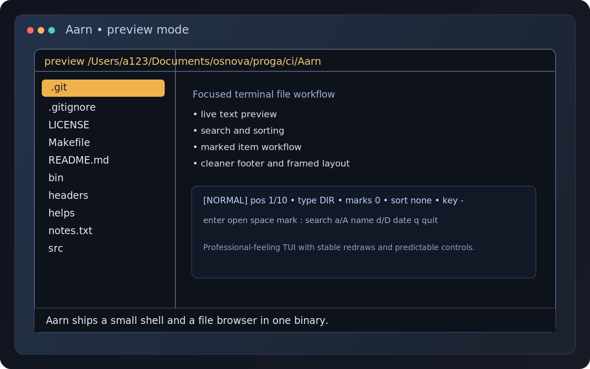
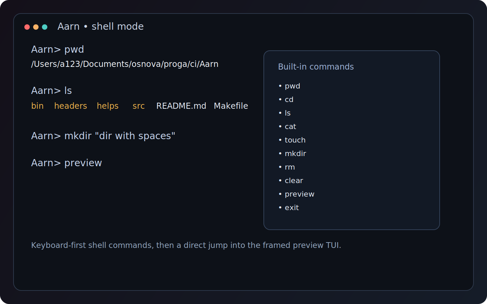

# Aarn

<p align="center">
  
</p>

<p align="center">
  <strong>Aarn</strong> is a keyboard-first terminal file shell with a built-in file browser, live preview pane, search, sorting, and marked-item workflow.
</p>

<p align="center">
  Fast navigation. Predictable TUI behavior. A focused file workflow without leaving the terminal.
</p>

## Why Aarn

Aarn combines a small shell and a file-oriented TUI in one binary. You can move around the filesystem, inspect files, batch-mark items, search, sort, and delete marked selections from a single interface. The current version is tuned for stable terminal behavior, clean redraws, and a more professional preview workflow.

## Screens

### Preview Mode

<p>
  
</p>

### Shell Mode

<p>
  
</p>

## Highlights

- Built-in shell commands for common filesystem tasks
- Framed preview UI with file list, live preview pane, and structured footer
- Marked-item workflow with `mark all`, `clear`, `invert`, and batch delete
- Fuzzy search inside preview mode
- Sorting by name and modification date
- Text-file viewer with scroll controls
- Safer terminal rendering with sanitized preview output
- Better raw-mode handling and terminal restoration on exit

## Built-In Commands

| Command | Description |
| --- | --- |
| `pwd` | Print current working directory |
| `cd [path]` | Change directory |
| `ls [-a] [path...]` | List directory contents |
| `cat [-h] file...` | Print file contents |
| `touch [-a] [-m] [-t STAMP] file...` | Create file or update timestamps |
| `mkdir [-p] [-v] [-m MODE] dir...` | Create directories |
| `rm [-f] [-i] [-I] [-r|-R] [-v] path...` | Remove files or directories |
| `clear` | Clear the shell screen |
| `preview` | Open the preview TUI |
| `exit` | Exit Aarn |

Quoted arguments and escaped spaces are supported:

```sh
mkdir "dir with spaces"
cat some\ file.txt
cd "/tmp/demo folder"
```

## Preview Controls

### Navigation

- `Up` / `Down` move the cursor
- `Right` / `Enter` open a directory
- `Left` / `Backspace` go to the parent directory
- `Enter` on a text file opens the viewer
- `q` exits preview mode

### Search And Sorting

- `:` enters search mode
- `Esc` clears search and returns to the full list
- `Enter` keeps the current filtered view
- `a` sorts by name ascending
- `A` sorts by name descending
- `d` sorts by date ascending
- `D` sorts by date descending
- `s` refreshes the current view

### Marked Mode

- `Space` toggles the current item
- `m` marks all visible items
- `u` clears all marks
- `i` inverts the marked state
- `x` deletes marked items
- `Esc` clears marks and returns to normal mode
- delete confirmation is single-key: `y`, `n`, or `Esc`

### Viewer

- `Up` / `Down` scroll text
- `q` or `Esc` closes the viewer

## Build

Standard build:

```sh
make all
```

Force a rebuild:

```sh
make rebuild
```

Debug build with sanitizers:

```sh
make debug
```

Run:

```sh
./bin/aarn
```

## What Was Polished Recently

- preview frame redesigned with continuous box-drawing characters
- footer restructured into status and help lines
- marked mode expanded from a basic counter into a usable batch workflow
- viewer exit behavior cleaned up
- preview edge rendering fixed near the right terminal border
- command entry and preview enter-handling improved across terminal variants

## Project Layout

```text
.
├── bin/
├── docs/assets/
├── headers/
├── helps/
├── issues/
└── src/
```

## Notes

- The preview pane is optimized for text files and safe terminal rendering.
- Binary files are detected and shown as non-previewable entries.
- Terminal state is restored on exit and on common termination paths.

## License

See [LICENSE](./LICENSE).
